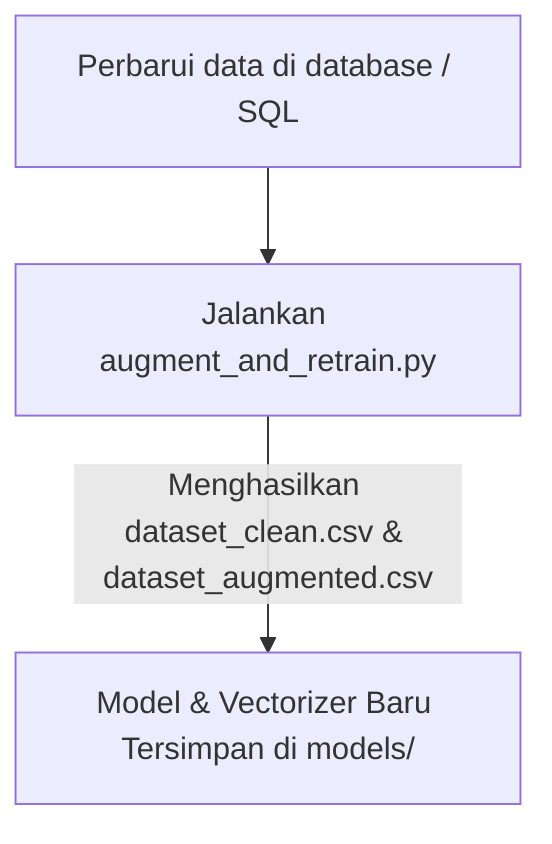

# Panduan Pengembangan Proyek Chatbot Bengkel

Dokumen ini berisi panduan alur kerja (*development workflow*) untuk menjalankan, memperbarui data, melatih ulang model, dan mengelola database proyek Chatbot Bengkel (Kurnia Motor).

---

## 1. Setup Awal Environment

Sebelum memulai pengerjaan, pastikan Anda telah membuat virtual environment agar pustaka Python tidak bentrok.

### Langkah-langkah:
1. **Buat Virtual Environment (venv):**
   ```bash
   python -m venv venv
   ```
2. **Aktifkan Virtual Environment:**
   - Di Windows (PowerShell):
     ```powershell
     .\venv\Scripts\Activate.ps1
     ```
   - Di Windows (CMD):
     ```cmd
     .\venv\Scripts\activate.bat
     ```
3. **Install Dependensi:**
   ```bash
   pip install -r requirements.txt
   ```
4. **Inisialisasi Database SQLite:**
   ```bash
   python scripts/db_manager.py --init
   ```
   *Perintah ini akan membuat berkas database `database/chatbot.db` beserta seluruh tabel dan data seeder awal yang diperlukan (data barang, diagnosa, dan template kalimat latih).*

---

## 2. Alur Retraining & Augmentasi Model (NLP)

Jika Anda ingin menambahkan variasi pertanyaan baru, merubah intent, atau memperbarui respon chatbot, ikuti alur berikut:



### Langkah-langkah:
1. **Perbarui Data Kalimat Latih (NLP):**
   - **Melalui Database**: Anda dapat mengedit isi tabel `intent_templates` langsung pada berkas SQLite `database/chatbot.db` untuk menambah variasi pertanyaan.
   - **Melalui Berkas SQL**: Buka file `database/schema_and_seed.sql`, cari bagian `INSERT INTO "intent_templates"`, lalu tambahkan baris baru untuk variasi pertanyaan yang diinginkan. Setelah mengedit berkas SQL, jalankan `python scripts/db_manager.py --init --seed` untuk me-reset dan mengimpor ulang ke database.
2. **Jalankan Augmentasi & Latih Ulang:**
   Jalankan skrip `augment_and_retrain.py` untuk mengekstrak data dari database, melakukan pembersihan teks (preprocessing), melakukan augmentasi, dan melatih ulang model Naive Bayes:
   ```bash
   python scripts/augment_and_retrain.py
   ```
   *Skrip ini secara otomatis melatih model baru dan menyimpannya di folder `models/` (`naive_bayes_model_augmented.pkl`, `tfidf_vectorizer_augmented.pkl`, `label_encoder_augmented.pkl`). Skrip ini juga akan mengevaluasi model pada data uji (train-test split 80-20), menyimpan grafik confusion matrix, dan menyimpan statistik di `metrics.json`.*

---

## 3. Alur Pembaruan Inventaris Barang & Keluhan (Database)

Informasi stok sparepart, harga, dan diagnosa keluhan disimpan di dalam database SQLite lokal (`database/chatbot.db`). Sebagai cadangan dan pelacakan versi di Git, semua perubahan dicadangkan ke dalam berkas `database/schema_and_seed.sql`.

### Langkah-langkah Pembaruan Data:
1. **Pembaruan via Web Dashboard (Direkomendasikan):**
   Petugas dapat menambah, mengedit, atau menghapus data sparepart langsung melalui halaman Web Dashboard `/dashboard_barang`.
2. **Pembaruan via Berkas SQL (Inisialisasi Ulang):**
   Anda juga dapat mengedit berkas `database/schema_and_seed.sql` langsung untuk memodifikasi baris `INSERT INTO "barang"`, `INSERT INTO "diagnosa_keluhan"`, atau `INSERT INTO "intent_templates"`. Setelah itu, terapkan perubahan ke database lokal dengan:
   ```bash
   python scripts/db_manager.py --init
   ```
3. **Simpan Perubahan Database ke Repositori Git (Backup Dump):**
   Setiap kali ada perubahan data (seperti stok baru atau perubahan harga dari web dashboard) yang ingin Anda simpan ke repositori Git:
   ```bash
   python scripts/db_manager.py --dump
   ```
   *Perintah ini akan mencadangkan struktur dan data master database lokal Anda kembali ke `database/schema_and_seed.sql`.*

---

## 4. Menjalankan Aplikasi Web (Flask)

Untuk menguji chatbot melalui antarmuka web secara lokal:

1. **Jalankan Flask Server:**
   ```bash
   python web/app.py
   ```
2. **Akses Browser:**
   Buka web browser dan akses alamat berikut:
   [http://127.0.0.1:5000/](http://127.0.0.1:5000/)

---

## 5. Alur Kerja Git Sederhana

Gunakan alur kerja Git berikut untuk menyimpan dan mengirimkan perubahan kode Anda ke repositori GitHub:

1. **Ambil Perubahan Terbaru dari GitHub (Pull):**
   Lakukan ini sebelum mulai menulis kode baru agar tidak terjadi konflik.
   ```bash
   git pull origin main
   ```
2. **Cek Status Perubahan:**
   Melihat file apa saja yang telah Anda ubah atau tambahkan.
   ```bash
   git status
   ```
3. **Simpan Perubahan secara Lokal (Commit):**
   ```bash
   git add .
   git commit -m "Deskripsi singkat perubahan Anda (misal: tambah intent sapaan)"
   ```
4. **Kirim Perubahan ke GitHub (Push):**
   ```bash
   git push origin main
   ```
