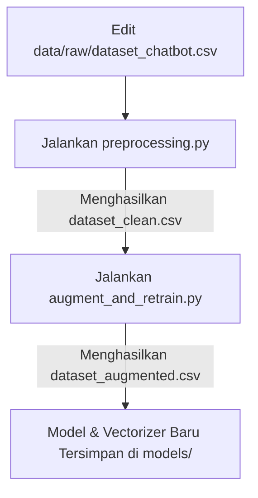

# Panduan Pengembangan Proyek Chatbot Bengkel

Dokumen ini berisi panduan alur kerja (*development workflow*) untuk menjalankan, memperbarui data, melatih ulang model, dan mengelola database proyek Chatbot Bengkel (Kurnia Motor).

---

## 1. Setup Awal Environment

Sebelum memulai pengerjaan, pastikan Anda telah membuat virtual environment agar pustaka Python tidak bentrok.

### Langkah-langkah:
1. **Buat Virtual Environment (venv):**
   ```bash
   python -m venv venv
   ```
2. **Aktifkan Virtual Environment:**
   - Di Windows (PowerShell):
     ```powershell
     .\venv\Scripts\Activate.ps1
     ```
   - Di Windows (CMD):
     ```cmd
     .\venv\Scripts\activate.bat
     ```
3. **Install Dependensi:**
   ```bash
   pip install -r requirements.txt
   ```
4. **Inisialisasi Database SQLite:**
   ```bash
   python scripts/setup_database.py
   ```
   *Perintah ini akan membuat berkas database `database/chatbot.db` beserta tabel-tabel awal yang diperlukan.*

---

## 2. Alur Retraining & Augmentasi Model (NLP)

Jika Anda ingin menambahkan variasi pertanyaan baru, merubah intent, atau memperbarui respon chatbot, ikuti alur berikut:



### Langkah-langkah:
1. **Perbarui Data Mentah:**
   Buka dan edit file `data/raw/dataset_chatbot.csv`. Tambahkan baris baru untuk pertanyaan/intent yang diinginkan.
2. **Jalankan Preprocessing:**
   Gunakan skrip `preprocessing.py` untuk membersihkan teks (case folding, remove symbols, stopword removal, stemming Sastrawi):
   ```bash
   python scripts/preprocessing.py
   ```
   *Skrip ini akan menyimpan hasilnya di `data/processed/dataset_clean.csv`.*
3. **Jalankan Augmentasi & Latih Ulang:**
   Jalankan skrip `augment_and_retrain.py` untuk melipatgandakan data (augmentasi teks) secara otomatis dan melatih model Naive Bayes:
   ```bash
   python scripts/augment_and_retrain.py
   ```
   *Skrip ini secara otomatis melatih model baru dan menyimpannya di folder `models/` (`naive_bayes_model_augmented.pkl`, `tfidf_vectorizer_augmented.pkl`, `label_encoder_augmented.pkl`). Skrip ini juga akan melakukan evaluasi otomatis terhadap 100 contoh pertanyaan tiruan.*

---

## 3. Alur Pembaruan Inventaris Barang (Database)

Informasi stok sparepart dan harga yang dibaca oleh chatbot disimpan di dalam database SQLite lokal (`database/chatbot.db`). File database asli tidak dilacak oleh Git agar tidak terjadi konflik perubahan data chat/stok lokal. Sebagai gantinya, Git melacak berkas `database/schema_and_seed.sql`.

### Langkah-langkah Pembaruan Data Barang:
1. **Perbarui Skrip Data:**
   Buka file `scripts/populate_barang_spareparts.py` dan sesuaikan data daftar barang, stok, atau harganya sesuai kebutuhan.
2. **Populasi Ulang Data:**
   Jalankan perintah berikut untuk mengisi atau memperbarui data barang di database lokal:
   ```bash
   python scripts/populate_barang_spareparts.py
   ```
3. **Simpan Perubahan Database ke Repositori Git:**
   Jika Anda menambah barang, kategori baru, atau memodifikasi tabel, Anda **WAJIB** menyimpan perubahan tersebut ke dalam SQL backup agar dapat diunggah ke GitHub:
   ```bash
   python scripts/dump_db.py
   ```
   *Perintah ini akan memperbarui `database/schema_and_seed.sql` sehingga perubahan struktur database dan data master terekam di Git.*

---

## 4. Menjalankan Aplikasi Web (Flask)

Untuk menguji chatbot melalui antarmuka web secara lokal:

1. **Jalankan Flask Server:**
   ```bash
   python web/app.py
   ```
2. **Akses Browser:**
   Buka web browser dan akses alamat berikut:
   [http://127.0.0.1:5000/](http://127.0.0.1:5000/)

---

## 5. Alur Kerja Git Sederhana

Gunakan alur kerja Git berikut untuk menyimpan dan mengirimkan perubahan kode Anda ke repositori GitHub:

1. **Ambil Perubahan Terbaru dari GitHub (Pull):**
   Lakukan ini sebelum mulai menulis kode baru agar tidak terjadi konflik.
   ```bash
   git pull origin main
   ```
2. **Cek Status Perubahan:**
   Melihat file apa saja yang telah Anda ubah atau tambahkan.
   ```bash
   git status
   ```
3. **Simpan Perubahan secara Lokal (Commit):**
   ```bash
   git add .
   git commit -m "Deskripsi singkat perubahan Anda (misal: tambah intent sapaan)"
   ```
4. **Kirim Perubahan ke GitHub (Push):**
   ```bash
   git push origin main
   ```
