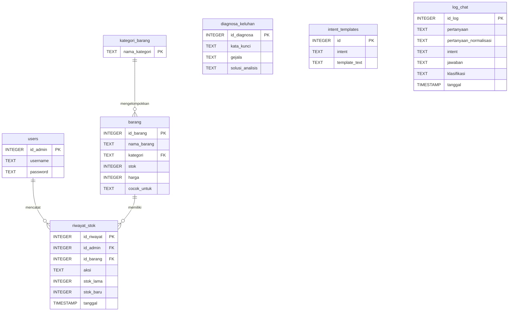

# METODOLOGI PENELITIAN DAN IMPLEMENTASI SISTEM CHATBOT

Dokumen ini menjelaskan rancangan metodologi, ekstraksi fitur, proses klasifikasi, arsitektur sistem, serta pengujian pada sistem Chatbot Bengkel Motor Kurnia. Seluruh tahapan disesuaikan dengan implementasi kode program aktual.

---

## 3. Preprocessing Data Teks
Data teks dari pertanyaan pengguna diproses melalui tahapan *preprocessing* untuk menstandardisasi kata, mengoreksi kesalahan ketik (*typo*), menyaring gangguan kata kasar, serta mereduksi variasi kata sehingga dapat dianalisis secara akurat oleh model klasifikasi. Tahapan *preprocessing* pada sistem ini dirancang secara berurutan sebagai berikut:

### a. Pembersihan Kata Kasar (Bad-Word Filtering)
Sebelum masuk ke tahap analisis, teks masukan diperiksa terhadap daftar kata tidak pantas (*bad words*) untuk menjaga etika interaksi. Jika terdeteksi kata kasar, sistem akan langsung mengembalikan respon peringatan dan menghentikan pemrosesan lebih lanjut.
* **Kamus Kata Kasar:** *anjing, bangsat, bgst, tolol, goblok, bego, kontol, memek, peler, pantek, babi, asu, jancok, jancuk, bajingan, brengsek, sialan, kampret, keparat, lonte, perek, jablay, idiot*.
* **Contoh:**
  `"woi anjing"` $\rightarrow$ Sistem menghentikan alur klasifikasi dan menampilkan respon peringatan kesopanan.

### b. Normalisasi Singkatan & Koreksi Salah Ketik (Fuzzy spelling correction)
Tahap ini menggabungkan pencocokan singkatan secara dinamis serta koreksi *typo* berbasis kemiripan string (*fuzzy matching*):
1. **Penerjemahan Singkatan:** Sistem menggunakan kamus singkatan lokal (*dictionary-mapping*) untuk mengubah bahasa gaul (*slang*) atau singkatan khas bengkel menjadi bentuk kata baku.
   * *Contoh singkatan:* `mtr` $\rightarrow$ `motor`, `srvs` $\rightarrow$ `servis`, `hrg` $\rightarrow$ `harga`, `ol` $\rightarrow$ `oli`, `ak` $\rightarrow$ `aki`, `yg` $\rightarrow$ `yang`, `gk`/`ga`/`gak` $\rightarrow$ `tidak`, `klo` $\rightarrow$ `kalau`.
2. **Koreksi Typo (Fuzzy Matching):** Menggunakan modul `difflib.get_close_matches` dengan ambang batas kecocokan (*cutoff*) sebesar 0.8. Masukan dicocokkan dengan kamus kosakata dinamis (*fuzzy vocabulary*) yang dibangun saat *runtime* dari daftar produk di database SQLite (`barang` & `kategori_barang`) serta kata-kata unik dalam dataset pelatihan.
   * **Contoh:**
     `"mtr sy brebet"` $\rightarrow$ `"motor saya brebet"`
     `"oli ymlub"` $\rightarrow$ `"oli yamalube"` (dikoreksi berdasarkan kosakata produk aktual)

### c. Cleaning Text
Menghapus karakter non-alfabet seperti tanda baca, simbol, angka, dan spasi verlebih menggunakan ekspresi reguler (*regular expression*):
* **Pola Regex:** `[^a-zA-Z\s]`
* **Contoh:**
  `"servis motor!!! 2026"` $\rightarrow$ `"servis motor "` $\rightarrow$ `"servis motor"`

### d. Case Folding
Mengubah seluruh huruf pada kalimat menjadi huruf kecil (*lowercase*) agar penulisan kata konsisten dan tidak sensitif terhadap penggunaan huruf kapital.
* **Contoh:**
  `"Servis Motor"` $\rightarrow$ `"servis motor"`

### e. Tokenizing
Kalimat dipecah menjadi kumpulan token kata individu dengan pemisah spasi (*whitespace splitting*).
* **Contoh:**
  `"servis motor saya"` $\rightarrow$ `["servis", "motor", "saya"]`

### f. Stopword Removal
Menghapus kata-kata umum (*stopwords*) bahasa Indonesia yang tidak memiliki bobot informasi penting dalam proses klasifikasi intent menggunakan pustaka **Sastrawi**.
* **Contoh:**
  `["saya", "ingin", "servis", "motor"]` $\rightarrow$ `["servis", "motor"]` (kata "saya" dan "ingin" dihapus)

### g. Stemming
Mengubah kata berimbuhan menjadi kata dasarnya. Pada penelitian ini, proses *stemming* menggunakan pustaka **Sastrawi** agar kata-kata berimbuhan bahasa Indonesia disederhanakan secara konsisten.
* **Contoh:**
  `["membeli", "perbaikan", "kendaraan"]` $\rightarrow$ `["beli", "baik", "kendara"]`

---

## 4. Ekstraksi Fitur
Data teks hasil *preprocessing* diubah menjadi representasi numerik menggunakan metode **Term Frequency–Inverse Document Frequency (TF-IDF)** melalui pustaka `scikit-learn` (`TfidfVectorizer`).

### a. Menghitung Term Frequency (TF)
Menghitung frekuensi kemunculan term ($t$) pada dokumen pertanyaan ($d$):
$$TF(t, d) = \frac{\text{Jumlah kemunculan } t \text{ dalam } d}{\text{Total kata dalam } d}$$

### b. Menghitung Inverse Document Frequency (IDF)
Mengukur tingkat keunikan suatu kata di seluruh dokumen dalam dataset pelatihan ($D$):
$$IDF(t, D) = \log \left( \frac{1 + |D|}{1 + |\{d \in D : t \in d\}|} \right) + 1$$
*Laplace smoothing ($+1$) diterapkan di pembilang dan penyebut untuk menghindari pembagian dengan nol.*

### c. Menghitung Bobot TF-IDF
Mengalikan nilai TF dengan nilai IDF untuk memperoleh bobot akhir term ($w$):
$$w(t, d) = TF(t, d) \times IDF(t)$$
* **Contoh:**
  Kata unik seperti `"brebet"` memiliki nilai IDF tinggi karena hanya muncul pada intent tertentu (`layanan_servis`), sedangkan kata umum seperti `"motor"` memiliki IDF lebih rendah karena tersebar di hampir semua intent.

### d. Membentuk Vektor Fitur
Seluruh bobot diubah menjadi representasi vektor numerik berdimensi $N$ (di mana $N$ adalah ukuran kosakata/fitur unik pada data latih) untuk menjadi masukan bagi algoritma pengklasifikasi.

---

## 5. Klasifikasi Menggunakan Naive Bayes dan Hybrid Cosine Similarity
Sistem menggunakan kombinasi algoritma **Multinomial Naive Bayes** sebagai klasifikasi intent utama, yang kemudian dikombinasikan dengan metode **Cosine Similarity** guna mengatasi kelemahan Naive Bayes yang cenderung *overconfident* (terlalu percaya diri terhadap prediksi yang salah).

### a. Perhitungan Multinomial Naive Bayes
Model menghitung probabilitas posterior untuk setiap kategori intent ($C$) berdasarkan representasi fitur kata ($W$):
$$P(C \mid W) = \frac{P(C) \prod_{i=1}^{n} P(w_i \mid C)}{P(W)}$$
* **Laplace Smoothing:** Untuk mencegah *Zero Probability* (nilai probabilitas nol mutlak akibat kata asing yang belum pernah dilatih), ditambahkan konstanta pemulusan $\alpha = 1$:
$$P(w_i \mid C) = \frac{N_{ic} + 1}{N_c + |V|}$$
di mana $N_{ic}$ adalah total bobot TF-IDF kata $w_i$ pada kelas $C$, $N_c$ adalah total bobot seluruh kata pada kelas $C$, dan $|V|$ adalah ukuran dimensi kosakata.

### b. Mekanisme Keamanan Multi-Threshold (Hybrid Cosine Similarity)
Untuk menjamin chatbot tidak memberikan jawaban yang keliru secara acak, diterapkan dua lapis ambang batas penyaringan:
1. **Threshold Naive Bayes:** Probabilitas prediksi tertinggi harus memenuhi $\ge 0.15$.
2. **Threshold Cosine Similarity:** Sudut kemiripan kosinus antara vektor input pengguna dengan template kalimat latih di database pada intent terpilih harus memenuhi $\ge 0.35$:
$$\text{Cosine Similarity}(A, B) = \frac{A \cdot B}{\|A\| \|B\|}$$
3. **Kombinasi Keyakinan (Combined Confidence):** Nilai keyakinan akhir dikombinasikan secara deterministik untuk pelaporan performa sistem:
$$\text{Combined Confidence} = \text{Probabilitas Naive Bayes} \times \text{Skor Cosine Similarity}$$

### c. Penanganan Fallback & Batasan Domain
Sistem membedakan kegagalan deteksi berdasarkan relevansi domain:
* **Fallback Lingkup Bengkel (`fallback_bengkel`):** Jika pertanyaan mengandung kata kunci dalam domain bengkel (*oli, servis, mesin, aki*, dll.) namun tidak cocok dengan template database, chatbot mengembalikan pesan penawaran bantuan admin WhatsApp (`open_wa`).
* **Fallback Luar Bengkel (`fallback_luar_bengkel`):** Jika masukan pengguna di luar bahasan (mengandung kata kunci terlarang seperti *dokter, politik, bank*, dll.), sistem membalas dengan penegasan batasan ruang lingkup chatbot.

---

## 6. Perancangan dan Implementasi Sistem
Sistem chatbot ini diimplementasikan menggunakan arsitektur web modern yang modular dan responsif.

### A. Arsitektur Perangkat Lunak (Modular Flask Blueprint)
Aplikasi Flask dipecah menjadi modul-modul terpisah (*Separation of Concerns*):
1. **`web/config.py`:** Konfigurasi global path dataset, database, dan ambang batas threshold.
2. **`web/database.py`:** Manajemen koneksi SQLite, fungsi pencatatan log interaksi, dan riwayat stok.
3. **`web/nlp/preprocessor.py`:** Fungsi preprocessing, kamus singkatan, kata kasar, dan koreksi fuzzy.
4. **`web/nlp/classifier.py`:** Logika klasifikasi Naive Bayes, penyaring domain, dan prioritas intent.
5. **`web/nlp/handlers.py`:** Eksekusi respon dinamis (keluhan motor, pencarian database produk, rekomendasi kecocokan barang).
6. **`web/routes/chat.py`:** Blueprint antarmuka chat pengguna dan API asinkron `/chat`.
7. **`web/routes/admin.py`:** Blueprint panel admin (CRUD stok barang, visualisasi grafik performa, dan pengelolaan log chat).
8. **`web/app.py`:** Entrypoint utama aplikasi.

### B. Desain Skema Database SQLite (`chatbot.db`)
Sistem terhubung ke database SQLite dengan skema hubungan tabel sebagai berikut:

### C. Desain Antarmuka Pengguna & Estetika Visual
* **Skema Warna Premium:** Desain didominasi Royal Blue (`#1b75bc`) dengan transisi mode gelap/terang adaptif.
* **Autosave AJAX & Real-time Search:** Log obrolan admin menggunakan Fetch API asinkron untuk menyimpan klasifikasi log secara otomatis serta penyaringan tab dinamis.
* **Visualisasi Performa:** Dilengkapi visualisasi matriks kebingungan (*confusion matrix*) beresolusi tinggi (300 DPI) langsung pada dashboard admin.

---

## 7. Pengujian dan Evaluasi Sistem
Pengujian model NLP dilakukan dengan membagi data latih dan data uji secara terstratifikasi (*stratified train-test split*).

### A. Dataset dan Pembagian Data
* **Data Awal (Templet Asli):** 294 baris data berlabel dari database SQLite (`intent_templates`).
* **Data Ekspansi (Augmentasi):** Data dikembangkan menjadi **529 baris** data berlabel menggunakan generator kalimat tanya.
* **Rasio Pembagian:** 80% Data Latih (423 baris) dan 20% Data Uji (106 baris).

### B. Metrik Evaluasi Klasifikasi
Evaluasi performa klasifikasi dihitung menggunakan metrik *Accuracy*, *Precision*, *Recall*, dan *F1-score*:

$$\text{Accuracy} = \frac{TP + TN}{TP + TN + FP + FN}$$
$$\text{Precision} = \frac{TP}{TP + FP}$$
$$\text{Recall} = \frac{TP}{TP + FN}$$
$$\text{F1-Score} = 2 \times \frac{\text{Precision} \times \text{Recall}}{\text{Precision} + \text{Recall}}$$

Hasil pengujian model akhir memperoleh nilai **Akurasi Keseluruhan sebesar 89.72%** dengan rincian per-intent kelas sebagai berikut:

| Intent Klasifikasi | Precision | Recall | F1-Score | Keterangan / Karakteristik Analisis |
| :--- | :---: | :---: | :---: | :--- |
| `sapaan` | 1.00 | 0.85 | **0.92** | Kalimat sapaan pembuka |
| `akhir_percakapan` | 1.00 | 1.00 | **1.00** | Teks ekspresi ucapan terima kasih |
| `kontak_admin` | 1.00 | 1.00 | **1.00** | Pertanyaan informasi WhatsApp bengkel |
| `bantuan_umum` | 0.90 | 0.90 | **0.90** | Pertanyaan fitur umum chatbot |
| `cek_stok` | 0.73 | 0.73 | **0.73** | Integrasi pencarian data barang |
| `daftar_barang` | 1.00 | 0.86 | **0.92** | Menampilkan daftar kategori |
| `harga_servis` | 1.00 | 1.00 | **1.00** | Pertanyaan biaya jasa servis |
| `info_barang` | 1.00 | 0.73 | **0.84** | Detail spesifikasi produk |
| `jadwal_bengkel` | 1.00 | 0.86 | **0.92** | Jam operasional buka/tutup |
| `layanan_servis` | 0.65 | 1.00 | **0.79** | Keluhan motor & jenis servis |
| `lokasi_bengkel` | 1.00 | 1.00 | **1.00** | Alamat maps dan rute |
| `rekom_produk` | 1.00 | 1.00 | **1.00** | Rekomendasi kecocokan sparepart |
| **Rata-rata Akurasi** | | | **89.72%** | **Performa Keseluruhan Model** |

### C. Analisis Hasil Evaluasi
* **Analisis Fungsional (Intent Utama vs Pendukung):** Evaluasi performa sistem dapat dikelompokkan menjadi dua kategori signifikansi fungsional. Pertama, kelompok *Intent Utama (Penting)* yang memuat transaksi inti (seperti cek stok, harga servis, rekomendasi produk, dll.) memiliki rata-rata performa F1-score sebesar **90.04%**. Kedua, kelompok *Intent Pendukung (Gak Penting)* yang mengatur alur percakapan kasual (seperti sapaan, ucapan terima kasih, dll.) memperoleh rata-rata F1-score sebesar **95.42%**.
* **Penyebab Presisi Sempurna (1.00) pada Intent Pendukung:** Tingginya nilai presisi (rata-rata 97.50% dan mayoritas bernilai 1.00) pada kelompok intent pendukung disebabkan oleh faktor *Vocabulary Uniqueness* (keunikan kosakata). Kata-kata pembuka/penutup seperti *"halo"*, *"pagi"*, *"terima kasih"*, dan *"wa admin"* memiliki pola kalimat yang sangat spesifik dan terisolasi dari bahasan otomotif. Hal ini membuat model Naive Bayes tidak pernah melakukan kesalahan prediksi (tidak ada *False Positive*) ketika mengklasifikasikan kalimat ke dalam kategori pendukung tersebut.
* **Analisis Tumpang Tindih Kosakata (Vocabulary Overlap) pada Intent Utama:** Pada kelompok intent utama, nilai presisi rata-rata berada di angka 92.22% dengan beberapa intent (seperti `cek_stok` sebesar 0.73 dan `layanan_servis` sebesar 0.65) berada di bawah 1.00. Hal ini disebabkan oleh tingginya *Vocabulary Overlap* (tumpang tindih kata kunci) di dalam domain bahasan bengkel. Kata kunci seperti *"servis"*, *"motor"*, *"oli"*, dan *"ganti"* tersebar merata di berbagai intent penting, sehingga batas keputusan (*decision boundary*) model klasifikasi menjadi lebih bias dan rentan menghasilkan salah klasifikasi (*False Positive*) sebelum diproses oleh modul *prioritizer* berbasis aturan (*rule-based*).
* **Efektivitas Preprocessing:** Pembersihan singkatan dan *spelling correction fuzzy* terbukti meningkatkan akurasi data uji mentah dari 61% menjadi 89.72% dengan mengurangi noise karakter penulisan pengguna.
